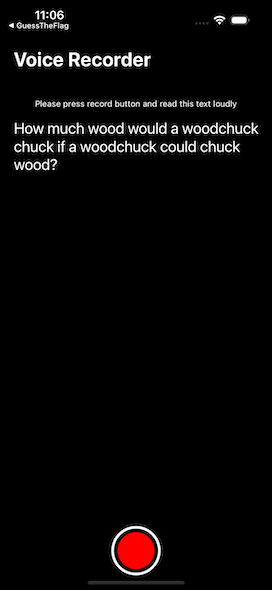

#  Test asignment VoiceDiagnostic

## Background
The task is to implement a single view iOS application. The user of the application should be able to record his/her voice while reading a sentence from the screen. Then the user should be able to play back the recording.

##Implementation
The app should be deveoped as an Xcode project, using Swift. 
The application should be able to perform the following tasks:
1. Record audio from the device’s microphone
2. Store the audio as a file on the device
a. You are free to choose file format
3. The sentence should be “How much wood would a woodchuck chuck if a woodchuck could
chuck wood?”
The user interface should be easy to understand and use. Feel free to be creative when designing the view. Bonus point if you use animations.

